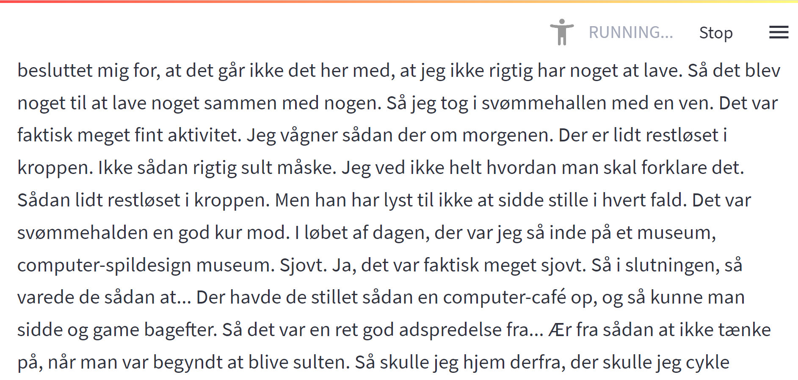

An example how to record, transcribe and visualize the transcriptions in a simple near-realtime-app using pyaudio, Whisper and streamlit. 

### Introduction
This repository contains of three main scripts:
1) `record.py` - Records 30 second audio files (.wav) from your PC (tested on Windows) 
2) `sound_to_text.py` - Loads the audio files generated 
3) `dashboard.py` - Visualizes the 50 most recent translated soundclips (updates when a new clip has been transcribed).

### Setup:
Install Python 3.9.5 (https://www.python.org/downloads/release/python-395/) 
Setup the environment from the `requirements.txt`-file. 
Install `ffmpeg` and possible `rust`, see more details here how to set it up: https://github.com/openai/whisper
I also had to enable "Stereo Mix" in Windows to be able to record the sound, see more here: https://www.howtogeek.com/howto/39532/how-to-enable-stereo-mix-in-windows-7-to-record-audio/

The scripts can be started with the following commmands after activating the environment: 
```
python record.py
python sound_to_text.py
streamlit run dashboard.py
```

### Example: 
Example of recorded and transcribed audio in Danish presented with a simple streamlit app:



...
